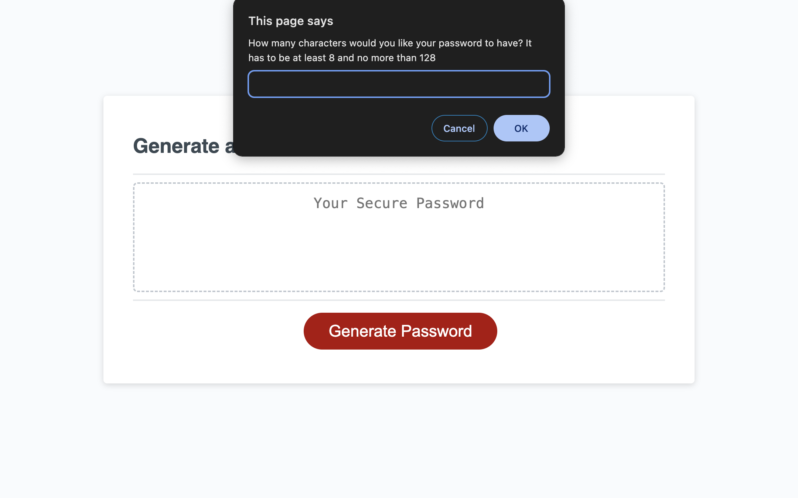
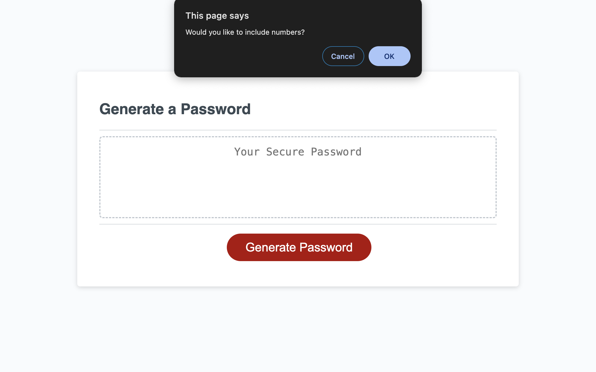
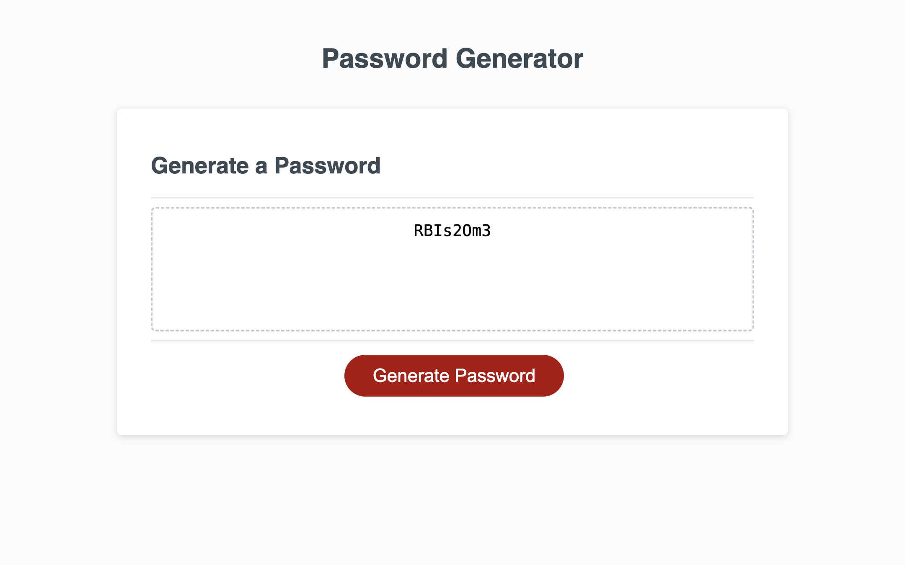
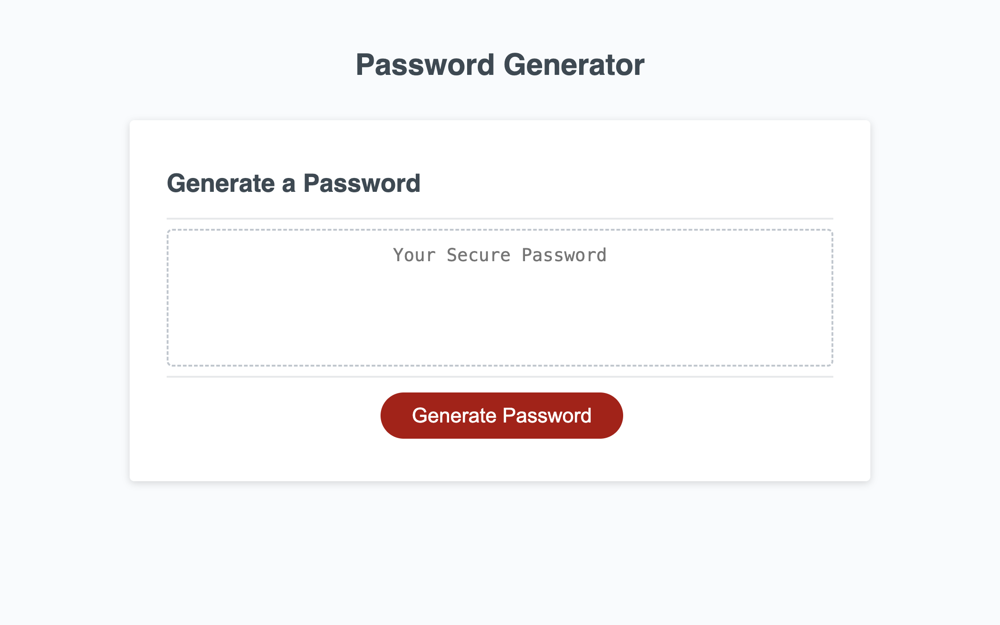

# password-generator

## Description
For this project, we as web developing, boot camp students, wanted to create a web application that teaches us how to use the basics of javacript by showing our knowledge of conditional statements, iteration, creating variables, functions, arrays, using the browser window to prompt the user and take in values the user picks, etc. All of this will ultimately help us to practice our skills and make us better coders.
The problem that was solved is that we were able to take starter code and add our own code to make the html file and the web browser functional all with javascript to where a user can interact with it. Also based on the users actions and choices create an app that will generate a random password based on those choices a user makes.

## Usage
You can use this web application to generate a random password, based on a length of 8-128 characters that can either be lower case letters, uppercase letters, numbers, or special characters. The user is able to pick the length they want and what type of characters they want. The app will prompt you with these questions after you click generate password, and then a password will be created and show up in the genreate passord box after all the questions are answered.

## Credits
A tutor helped me, Scott Everett, when it came to creating the logic behind if a user wants a specific type of character in their password, then the password must contain that character. I also asked my instructor a few questions about the code that I was writing to see if I was in on the right track. He gave me some great tips and helped me to clean up my code.

## Technologies
Html, CSS, JavaScript

## Questions
For any questions, please reach out by creating an issue.

## Deployment Section
https://brianguthrie88.github.io/password-generator/

